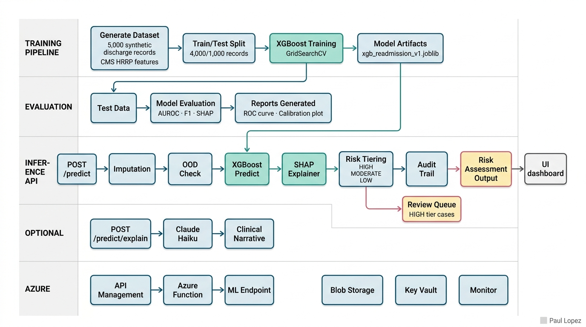

# readmission-risk-scorer

## Professional Context and IP Notice

This prototype is a reference design built to demonstrate the type of
work I do as an AI architect in healthcare and enterprise contexts. It
does not contain proprietary information, client data, trade secrets,
internal systems knowledge, or confidential materials from any current
or former employer or their clients. All data is synthetic, all
architecture patterns are based on publicly available technologies and
standards, and all code was written independently on personal equipment
outside of employment obligations.

The scenarios and domain context (prior authorization, denial
management, payer operations) reflect publicly understood healthcare
industry problems, not any specific client engagement or internal system.

---

A classical machine learning model that predicts 30-day hospital readmission risk
at discharge using XGBoost and SHAP explainability. No language model in the
critical path.

CMS has penalized hospitals up to 3% of Medicare DRG payments for excess
readmissions since 2013. Every discharge is a decision point: which patients need
intensive care coordination, and which can follow a standard protocol? This
prototype scores that decision at discharge time, explains which features drove
the score, and routes high-risk patients to a human review queue before any care
coordination action is triggered. The evaluation harness includes a ROI model:
the Azure ML endpoint costs roughly $0.38/day at 50 discharges/day; one prevented
readmission avoids up to $15,000 in CMS penalties.

**Demo Track:** FastAPI on localhost:8000, `MOCK_MODEL=true`, no dependencies beyond Python 3.11
**Live Inference:** `MOCK_MODEL=false` — loads committed `models/` artifacts, real XGBoost + SHAP
**Hyperscaler Track:** Azure ML managed online endpoint (Terraform)
**Related Repos:** [clinical-denial-reason-extractor](https://github.com/paullopez-ai/clinical-denial-reason-extractor) · [prior-auth-radar](https://github.com/paullopez-ai/prior-auth-radar)

---

## Architecture

```
┌────────────────────────────────────────────────────────────────┐
│                   readmission-risk-scorer                      │
│                                                                │
│  TRAINING PIPELINE (one-time, offline)                         │
│  ┌──────────────────────────────────────────────────────────┐  │
│  │  scripts/generate-dataset.py                             │  │
│  │    Synthetic 5,000 discharge records                     │  │
│  │    → data/train.csv (4,000 records)                      │  │
│  │    → data/test.csv  (1,000 records, held-out)            │  │
│  │                                                          │  │
│  │  scripts/train.py                                        │  │
│  │    XGBoost classifier + StandardScaler                   │  │
│  │    Hyperparameter tuning via GridSearchCV                │  │
│  │    → models/xgb_readmission_v1.joblib                   │  │
│  │    → models/scaler_v1.joblib                             │  │
│  │    → models/feature_names.json                          │  │
│  └──────────────────────────────────────────────────────────┘  │
│                                                                │
│  EVALUATION (post-training)                                    │
│  ┌──────────────────────────────────────────────────────────┐  │
│  │  scripts/evaluate.py                                     │  │
│  │    AUROC, F1, precision-recall, calibration plot         │  │
│  │    SHAP summary plot (global feature importance)         │  │
│  │    Threshold sensitivity analysis (High/Mod/Low tiers)   │  │
│  │    Cost-per-prediction + ROI model                       │  │
│  │    → reports/eval-report.json                           │  │
│  │    → reports/shap-summary.png                           │  │
│  │    → reports/roc-curve.png                              │  │
│  │    → reports/calibration-plot.png                       │  │
│  └──────────────────────────────────────────────────────────┘  │
│                                                                │
│  INFERENCE API (Demo: local FastAPI, port 8000)                │
│  ┌──────────────────────────────────────────────────────────┐  │
│  │  src/api/main.py                                         │  │
│  │    POST /predict                                         │  │
│  │      input:  DischargeRecord (Pydantic)                  │  │
│  │      output: RiskAssessment (Pydantic)                   │  │
│  │               { risk_score, risk_tier, shap_factors[],   │  │
│  │                 recommended_actions[], model_version,    │  │
│  │                 prediction_id, timestamp,                │  │
│  │                 inference_ms, cost_usd }                 │  │
│  │                                                          │  │
│  │    POST /predict/explain  (Track 2: + LLM narrative)     │  │
│  │    GET  /eval-report                                     │  │
│  │    GET  /review-queue                                    │  │
│  │    GET  /health                                          │  │
│  └──────────────────────────────────────────────────────────┘  │
└────────────────────────────────────────────────────────────────┘
```



The architecture separates three distinct phases. The training pipeline (one-time,
offline) generates synthetic discharge records, fits a StandardScaler and XGBoost
classifier, and produces committed model artifacts. The evaluation harness
(post-training) runs the held-out test set through AUROC, calibration, and SHAP
analysis and commits all outputs to `reports/` so the benchmark is reproducible.
The inference API (FastAPI locally or Azure Function/AML endpoint) loads the
committed artifacts and returns a risk assessment with SHAP explanations in under
15ms. No language model is in the path from discharge record to risk score.

<!-- DIAGRAM: see docs/architecture.mermaid for rendered version -->

---

## Demonstrated Capabilities

### Evaluation and Quality Judgment

> *From the Architect:* Accuracy alone does not tell you whether a risk model
> should be trusted in a clinical workflow. The evaluation harness produces three
> additional artifacts that do. The calibration plot checks whether the model's
> predicted probabilities are trustworthy, not just well-ranked. The SHAP global
> summary plot shows which features the model actually learned to rely on and
> whether they match clinical intuition: prior admissions, high comorbidity index,
> and SNF discharge should be at the top. If they are not, something is wrong with
> the training data, and the plot makes that visible before deployment. The held-out
> test set is committed to the repo so the benchmark is reproducible by anyone.

**Key implementation:** [`scripts/evaluate.py`](scripts/evaluate.py) — AUROC, calibration, SHAP global summary;
[`reports/eval-report.json`](reports/eval-report.json) — committed benchmark

**Eval results (committed):**
| Metric | Value |
|--------|-------|
| Test AUROC | 0.9656 |
| PR-AUC | 0.8761 |
| Calibration ECE | 0.0144 |
| Top SHAP feature | `prior_admissions_12m` |
| p50 inference latency | 0.76ms |
| p95 inference latency | 1.11ms |

> **Note on AUROC:** The synthetic training labels are generated via a deterministic
> threshold on a clinical risk score. This produces cleaner labels than real EHR data
> and consequently higher AUROC. Real-world readmission models on production EHR data
> typically achieve 0.78-0.82 AUROC for this feature set.

---

### Trust and Security Design

> *From the Architect:* A risk score a clinician cannot audit is a risk score a
> clinician will not use. Every prediction from this API carries a full audit trail:
> prediction ID, model version, a hash of the input features (traceable without
> storing PHI), risk score, tier, inference latency, and timestamp. High-tier
> predictions are written to a review queue before care coordination actions are
> triggered. If input features fall outside the training distribution, the response
> includes an out-of-distribution warning. Imputed features are disclosed in the
> response. The three-tier classification maps directly to care coordination
> protocols so the output is actionable, not just informational.

**Key implementation:** [`src/utils/risk_tier.py`](src/utils/risk_tier.py) — threshold routing;
[`src/utils/audit.py`](src/utils/audit.py) — per-prediction audit trail;
[`src/utils/ood_check.py`](src/utils/ood_check.py) — distribution monitoring

---

### Cost and Token Economics

> *From the Architect:* Classical ML inference economics are completely different
> from language model economics, and that difference is the point. XGBoost inference
> on a single discharge record runs in under 5ms locally. The SHAP calculation adds
> another 2-7ms. On Azure ML Standard_DS2_v2, the full round trip including SHAP is
> under 15ms at p95. At 50 discharges per day, the Azure ML endpoint costs $0.38/day.
> One prevented readmission avoids up to $15,000 in CMS HRRP penalties. The eval
> report includes this ROI model explicitly so the economics are demonstrable, not
> estimated. Every inference call logs its cost so the cumulative picture is
> trackable.

**Key implementation:** [`src/utils/cost.py`](src/utils/cost.py) — inference cost instrumentation;
[`reports/eval-report.json`](reports/eval-report.json) — ROI model and latency benchmarks

---

## Demo Track Setup

```bash
# Clone and install (Python 3.11 required; see Troubleshooting below)
git clone https://github.com/paullopez-ai/readmission-risk-scorer
cd readmission-risk-scorer

# Install dependencies (--prefer-binary required for llvmlite; see Troubleshooting)
python3.11 -m venv .venv && source .venv/bin/activate
pip install --prefer-binary -e ".[dev]"

# Copy env template
cp .env.example .env
# For demo track: MOCK_MODEL=true (no model loading, no API key needed)

# Start inference API (demo track, mock mode)
MOCK_MODEL=true uvicorn src.api.main:app --port 8000 --reload
# API running at http://localhost:8000

# Test Scenario 1 (high-risk patient)
curl -X POST http://localhost:8000/predict \
  -H "Content-Type: application/json" \
  -d '{
    "primary_dx_group": "HF",
    "comorbidity_index": 5,
    "length_of_stay_days": 7,
    "age_group": "75-84",
    "prior_admissions_12m": 3,
    "procedure_count": 2,
    "discharge_disposition": "SNF",
    "icu_flag": true,
    "emergency_admit_flag": true,
    "insurance_type": "MEDICARE",
    "specialist_consult_ct": 1,
    "incomplete_dc_flag": true,
    "weekend_discharge": false
  }'
# Expected: risk_score ~0.81, risk_tier "HIGH",
#           shap_factors with top 3 drivers,
#           recommended_actions list

# Run live inference with committed model (no API key needed)
MOCK_MODEL=false uvicorn src.api.main:app --port 8000
# Same curl above; now runs real XGBoost inference (~3-7ms)

# View eval report
curl http://localhost:8000/eval-report
# Returns committed reports/eval-report.json

# Run tests (all use MOCK_MODEL=true automatically)
pytest tests/ -v
```

---

## Hyperscaler Track Setup (Azure ML)

```bash
# Prerequisites: Azure CLI configured, Python 3.11, Terraform

# Step 1: package model artifacts for Azure ML
python scripts/package-model.py
# Creates model.tar.gz with model + scaler + inference script

# Step 2: provision infrastructure
cd infra/terraform
terraform init
terraform plan
terraform apply
# Outputs: aml_endpoint_url, function_app_url, apim_url

# Step 3: validate Azure ML endpoint directly
python scripts/test-aml-endpoint.py \
  --endpoint-name readmission-risk-scorer-v1
# Expected: RiskAssessment JSON for Scenario 1 test case

# Step 4: validate via Azure Function / APIM
curl -X POST https://[function-app-url]/api/predict \
  -H "Content-Type: application/json" \
  -d '{"primary_dx_group": "HF", "comorbidity_index": 5, ...}'
```

**Cost guardrail:** Azure ML managed online endpoints accrue cost at rest.
Run `terraform destroy` after each demo session. Estimated cost for a 2-hour demo
session: < $0.20. Set a $20/month Azure cost alert on the Resource Group.

---

## Troubleshooting

See [`cautions.md`](cautions.md) for detailed fixes. Summary:

| Issue | Fix |
|-------|-----|
| uv picks Python 3.14, breaks numba | `.python-version` pins to `3.11`; `pyproject.toml` has `requires-python = ">=3.11,<3.14"` |
| llvmlite build fails (no LLVM installed) | `pip install --prefer-binary -e ".[dev]"` |
| XGBoost: `libomp.dylib` not loaded | `brew install libomp` |
| `sklearn` not found after venv recreation | `deactivate && source .venv/bin/activate` |
| SHAP `ValueError: could not convert string to float: '[1.8375E-1]'` | SHAP 0.49 + XGBoost 3.x incompatibility; fixed by using `booster.predict(dm, pred_contribs=True)` |

---

## Project Structure

```
readmission-risk-scorer/
├── src/
│   ├── api/
│   │   ├── main.py                    # FastAPI app entry point
│   │   └── routes/
│   │       ├── predict.py             # POST /predict + /predict/explain
│   │       ├── eval.py                # GET /eval-report
│   │       ├── review.py              # GET /review-queue
│   │       └── health.py              # GET /health
│   ├── models/
│   │   ├── discharge_record.py        # Pydantic input schema (13 features)
│   │   └── risk_assessment.py         # Pydantic output schema
│   └── utils/
│       ├── inference.py               # XGBoost load + feature encoding
│       ├── shap_explainer.py          # SHAP value computation
│       ├── risk_tier.py               # HIGH/MODERATE/LOW threshold routing
│       ├── imputation.py              # Missing feature handling
│       ├── ood_check.py               # Out-of-distribution detection
│       ├── cost.py                    # Inference cost + ROI model
│       └── audit.py                   # Feature hash + review queue
├── scripts/
│   ├── generate-dataset.py            # Synthetic 5K discharge records
│   ├── train.py                       # XGBoost + GridSearchCV
│   └── evaluate.py                    # Full eval harness + ROI model
├── models/                            # Committed trained artifacts
├── data/                              # Committed synthetic datasets
├── reports/                           # Committed eval outputs + plots
├── docs/
│   ├── architecture.mermaid           # System diagram (nano-banana rendered)
│   └── interview-demo-guide.md        # 5-scenario demo walkthrough
└── infra/terraform/                   # Azure ML + Functions + APIM (Phase 5)
```
